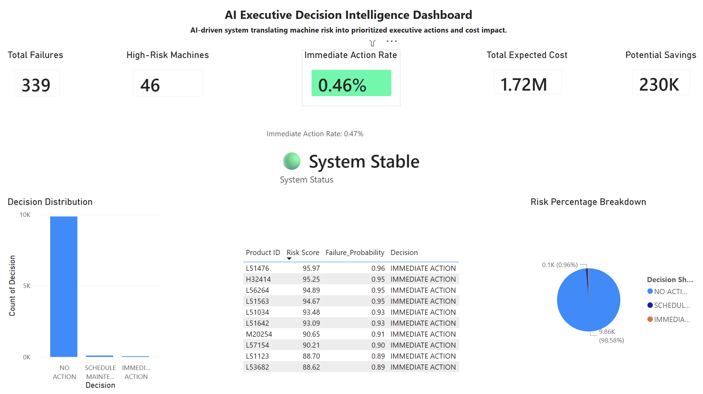

# AI Executive Decision Intelligence System

## Overview
This project presents an AI-driven decision intelligence system designed to translate machine risk into clear, prioritized executive actions. It bridges the gap between predictive analytics and real-world decision-making by delivering actionable insights and financial impact in a single dashboard.

---

## Business Problem
Industrial operations generate vast amounts of machine data, but decision-making is often:
- Reactive instead of proactive  
- Data-heavy but insight-poor  
- Lacking clear action prioritization  

Executives need a system that answers:
* What should we do next, and what is the financial impact?

---

## Solution
Built a decision intelligence layer on top of predictive outputs to:

- Classify machine status into:
  - No Action  
  - Monitor Closely  
  - Immediate Action  

- Provide a real-time system health indicator  
- Prioritize the Top 10 highest-risk machines  
- Quantify cost exposure and potential savings  
- Deliver insights through an executive-ready Power BI dashboard  

---

## Key Features
- Executive KPI panel (Failures, Risk, Cost, Savings)
- Decision classification engine
- System Status indicator (Stable / Warning / Critical)
- Immediate Action Rate metric
- Top 10 high-risk machine prioritization
- Decision distribution visualization
- Risk percentage breakdown

---

## Business Impact
- 339 total failures identified  
- 46 high-risk machines detected  
- $1.72M total cost exposure  
- $230K potential savings  
- 0.46% immediate action rate  

* Enables faster, data-driven executive decision-making and reduces operational risk.

---

## Tech Stack
- Python (Pandas, NumPy)
- Power BI (Dashboard & Visualization)
- Machine Learning (Decision Logic)
- Data Processing & Risk Scoring

---

## Project Structure

- Dashboard → AI_Executive_Decision_Intelligence_Dashboard.pbix  
- Notebook → ai_executive_decision_system.ipynb  
- Dataset → executive_decision_output.csv  
- Preview → AI_Executive_Decision_Intelligence_System.png  
- Documentation → README.md  

---

## Dashboard Preview

---

## Key Insight
This project goes beyond prediction.

* It transforms data into decisions  
* It translates risk into action  
* It converts insights into financial impact  

---

## Outcome
The system enables organizations to:
- Reduce downtime risk  
- Improve maintenance prioritization  
- Accelerate executive decision-making  
- Maximize cost efficiency  

---

## Author
Mohammed Shadid                   
MBA (AI & Business Analytics)  
Aspiring AI Strategy & Consulting Professional
